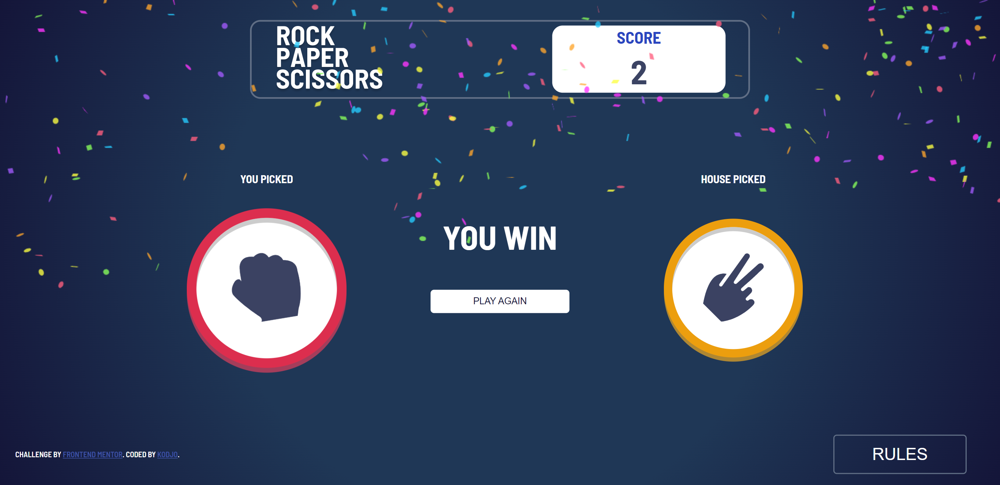

# Frontend Mentor - Rock, Paper, Scissors solution

This is a solution to the [Rock, Paper, Scissors challenge on Frontend Mentor](https://www.frontendmentor.io/challenges/rock-paper-scissors-game-pTgwgvgH). Frontend Mentor challenges help you improve your coding skills by building realistic projects. 

## Table of contents

- [Overview](#overview)
  - [The challenge](#the-challenge)
  - [Screenshot](#screenshot)
  - [Links](#links)
- [My process](#my-process)
  - [Built with](#built-with)
  - [What I learned](#what-i-learned)
  - [Useful resources](#useful-resources)
- [Author](#author)

## Overview

### The challenge

Users should be able to:

- View the optimal layout for the game depending on their device's screen size
- Play Rock, Paper, Scissors against the computer
- Maintain the state of the score after refreshing the browser _(optional)_

### Screenshot

### Links

- Solution URL: [Add solution URL here](https://your-solution-url.com)
- Live Site URL: [Add live site URL here](https://your-live-site-url.com)

## My process
I started with HTML then CSS and then JS where I used Math.ramdom() to determine
a random valuefor the computer, Then with a bit of logic I managed to do the rest
commands needed
### Built with

- Semantic HTML5 markup
- CSS custom properties
- Flexbox
- CSS Grid

### What I learned

I didn't learn much except that I used CSS grid for the first time

### Useful resources

- [confetti](https://github.com/catdad/canvas-confetti) - Ma help put the confetti when the user wins.

## Author

- Website - [Kodjo Henoc](https://github.com/henoceli3?tab=repositories)
- Frontend Mentor - [henoceli3](https://www.frontendmentor.io/profile/henoceli3)
- Twitter - [@henockodjo](https://www.twitter.com/henockodjo)
